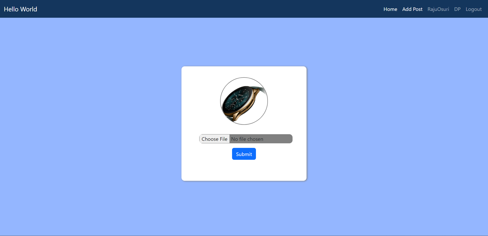

# Social-Group-Chat-App
An app for group chatting created using Django Framework

<h2>Login to your account</h2>

If you have no account, you can register for a new.

<h2>You home will look like this.</h2>

<h2>Add your Post or message </h2>

<h2>You can change your DP as well</h2>

<h2>Admin's</h2>
<h3>Admin has permission to delete a post or ban an user</h3>

If a user got banned by admin the user will lose permission to post or message.

